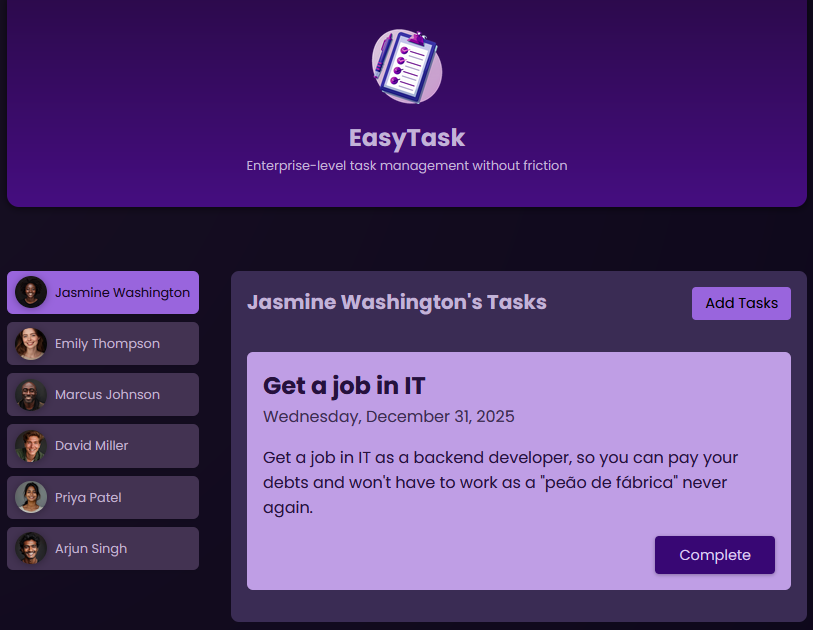
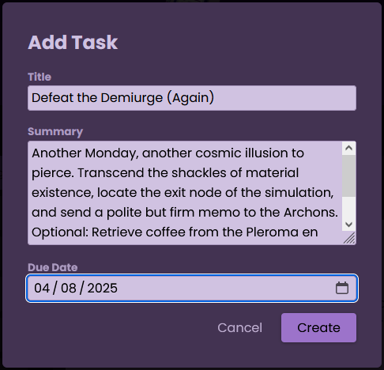
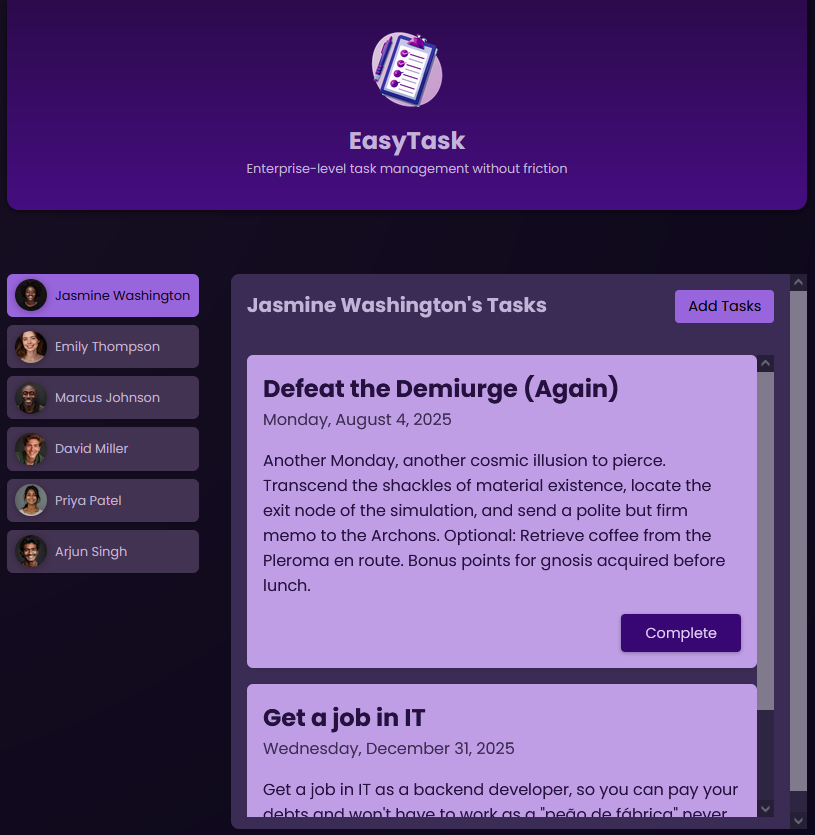

# 📝 Easy Task Manager

**Easy Task Manager** é um projeto Angular desenvolvido para fins de estudo, com a proposta de gerenciar tarefas. Trata-se de uma aplicação funcional, com foco em experiência do usuário e boas práticas de front-end moderno.

---

## 🚀 Tecnologias Utilizadas

- [Angular 18](https://angular.io/)
- TypeScript
- HTML5 & CSS3
- Vite (via Angular CLI)
- Node.js & npm

---

## ✨ Funcionalidades

- Criar, listar e remover tarefas
- Persistência temporária em memória
- Feedback visual em tempo real
- UI simples e direta, com responsividade básica
- Arquitetura baseada em componentes standalone

---

## 📸 Screenshots

### 🗂️ Lista de Tarefas

### ➕ Criando uma Nova Tarefa

### ✅ Tarefa Adicionada com Sucesso

---

## 🛠️ Como Rodar o Projeto

### Pré-requisitos

- Node.js (v18 ou superior)
- npm (v9 ou superior)

### Instalação

1. Instale as dependências com "npm install"

2. Rode o projeto com "npm start"

A aplicação estará disponível em http://localhost:4200.

---

## 💭 Considerações Finais

Este projeto foi desenvolvido com Angular como parte de um portfólio pessoal, com foco em aprendizado e prática de desenvolvimento front-end moderno.
